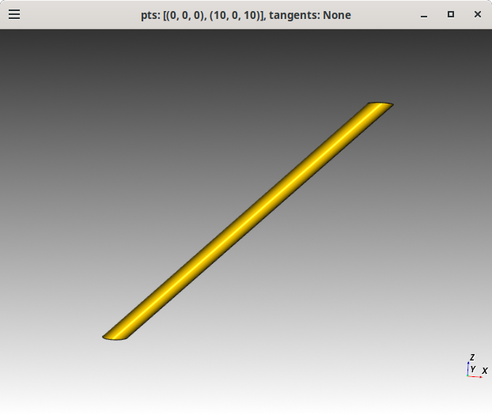
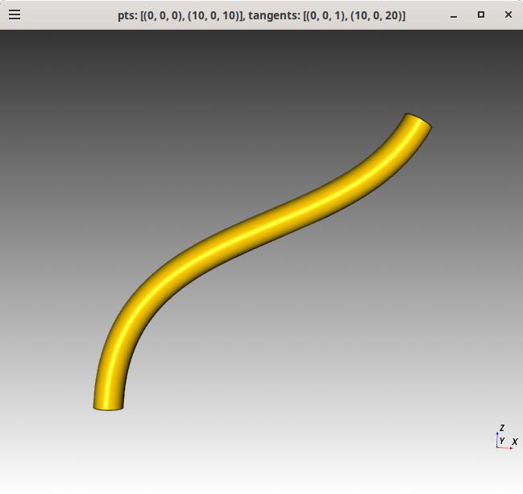
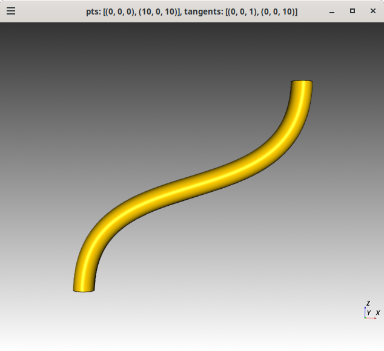

# cq-sweep

Explore using cadquery workplane.sweep which sweeps along a spline.
Using https://github.com/CadQuery/cadquery/blob/v2.5.2/examples/Ex023_Sweep.py as a base.


Setup a python virtual environment and install the dependencies for
cadquery v2.5.2, see enviroment.yml for the dependencies.

## Usage

```bash
$ ./cq-sweep.py -h
usage: cq-sweep.py [-h] [-p PTS] [-t TANGENTS]

Sweep a cylinder along a path defined by points and optional tangents.

options:
  -h, --help            show this help message and exit
  -p PTS, --pts PTS     List of points defining the path. Example: --pts='[(0,0,0),(10,0,10)]'
  -t TANGENTS, --tangents TANGENTS
                        List of tangents for the path. Example: --tangents='[(0,0,1),(10,0,10)]'
```

## Example

Straight cylinder along a path defined by points.
```bash
$ ./cq-sweep.py --pts="[(0,0,0),(10,0,10)]"
```




Curved cylinder along a path defined by points and tangents.
The odd thing is that the top face of the cylinder is not parallel to the
bottom face of the cylinder.
```bash
$ ./cq-sweep.py --pts="[(0,0,0),(10,0,10)]" --tangents="[(0,0,1),(10,0,20)]"
```


Curved cylinder along a path defined by points and tangents
with top and bottom faces parallel to each other. This was
accomplished by using the a horzonital tangent, which is odd.
```bash
$ ./cq-sweep.py -p="[(0,0,0),(10,0,10)]" -t="[(0,0,1),(0,0,10)]"
```


## License

Licensed under either of

- Apache License, Version 2.0 ([LICENSE-APACHE](LICENSE-APACHE) or http://apache.org/licenses/LICENSE-2.0)
- MIT license ([LICENSE-MIT](LICENSE-MIT) or http://opensource.org/licenses/MIT)

### Contribution

Unless you explicitly state otherwise, any contribution intentionally submitted
for inclusion in the work by you, as defined in the Apache-2.0 license, shall
be dual licensed as above, without any additional terms or conditions.
