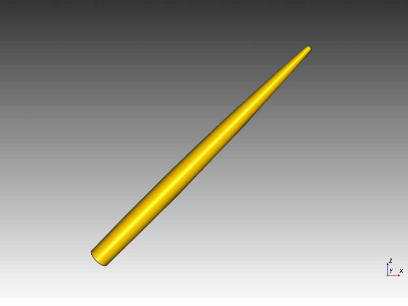
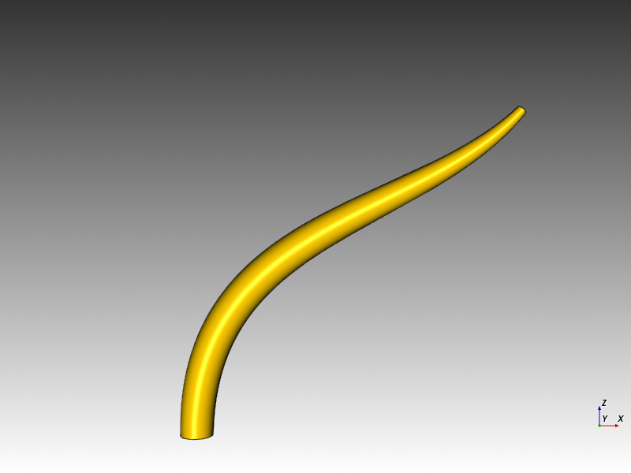
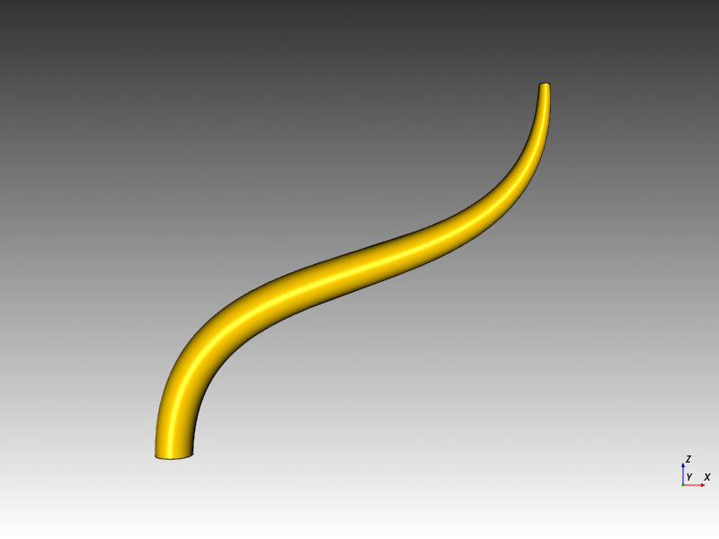
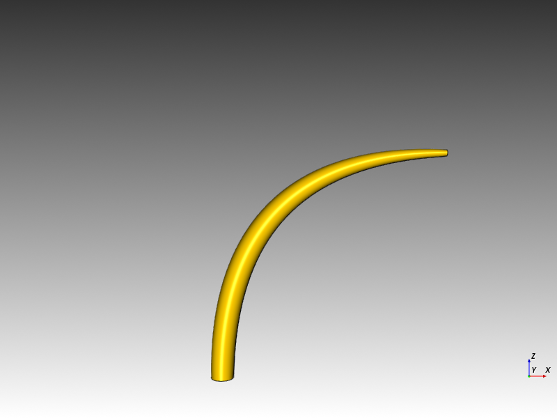
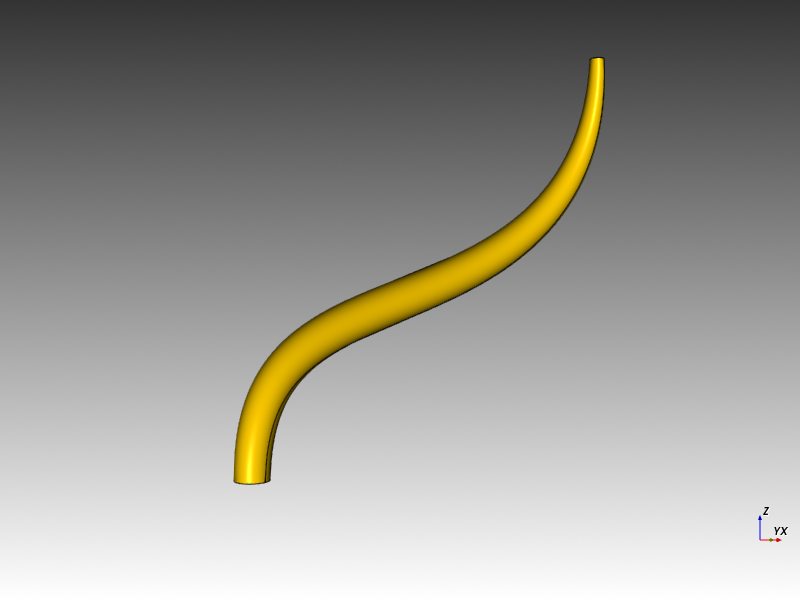

# cq-sweep

Explore using cadquery workplane.sweep which sweeps along a spline.
Using https://github.com/CadQuery/cadquery/blob/v2.5.2/examples/Ex023_Sweep.py as a base.

## Prerequisites

- [make](https://www.gnu.org/software/make/)
- [git](https://git-scm.com/downloads)
- [Python 3.9](https://www.python.org/downloads/)
- [micromamba](https://micromamba.snakepit.net/)
- [conda-build](https://github.com/conda/conda-build) 
  - `micromamba install -n base conda-build -c conda-forge`
  - `micromamba activate base`

## Install

Clone the repository and run `make setup` to install dependencies.
```bash
git clone https://github.com/youruser/cq-sweep.git
cd cq-sweep
make setup
```

This:
- Initializes the CadQuery submodule
- Creates the `cq-sweep` micromamba environment
- Builds and installs your local `deps/cadquery` fork (no pip required)

## Usage

```bash
$ ./cq-sweep.py -h
cq path: /home/wink/data/prgs/3dprinting/cq-sweep/deps/cadquery/cadquery/__init__.py
usage: cq-sweep.py [-h] [-br BASE_RADIUS] [-tr TOP_RADIUS] [-ml MID_LOCATION] [-p PTS] [-t TANGENTS] [-vu VIEW_UP] [-pos POSITION] [-fp FOCAL_POINT] [-cr CLIPPING_RANGE] [-z ZOOM] [-r ROLL]
                   [-e ELEVATION] [-a AZIMUTH] [-oas OUTPUT_ASCII_STL] [-ns] [-opng OUTPUT_PNG]

Sweep a cylinder along a path defined by points and optional tangents.

options:
  -h, --help            show this help message and exit
  -br BASE_RADIUS, --base_radius BASE_RADIUS
                        Base radius of the cylinder. Example: --base_radius=0.5
  -tr TOP_RADIUS, --top_radius TOP_RADIUS
                        Top radius of the cylinder. Example: --top_radius=0.15
  -ml MID_LOCATION, --mid_location MID_LOCATION
                        Location of mid section where transition begins to top_radius. value between 0..1. Example: --mid_location=0.5
  -p PTS, --pts PTS     List of points defining the path. Example: --pts='[(0,0,0),(10,0,10)]'
  -t TANGENTS, --tangents TANGENTS
                        List of tangents for the path. Example: --tangents='[(0,0,1),(10,0,20)]'
  -vu VIEW_UP, --view-up VIEW_UP
                        ViewUp XYZ tuple. Example: --view-up='(0, 0, 1)'
  -pos POSITION, --position POSITION
                        Position XYZ tuple. Example: --position='(5.0, -20.0, 5.0)'
  -fp FOCAL_POINT, --focal-point FOCAL_POINT
                        Focal point XYZ tuple. Example: --focal-point='(5.0, 0.0, 5.0)'
  -cr CLIPPING_RANGE, --clipping-range CLIPPING_RANGE
                        Clipping range (near,far) tuple. Example: --clipping-range='(-0.1, 1000.01)'
  -z ZOOM, --zoom ZOOM  Camera Zoom for png. Example: --zoom=1
  -r ROLL, --roll ROLL  Camera Roll angle for png. Example: --roll=-35
  -e ELEVATION, --elevation ELEVATION
                        Camera Elevation for png. Example: --elevation=-45
  -a AZIMUTH, --azimuth AZIMUTH
                        Camera azimuth for png. Example: --azimuth=0
  -oas OUTPUT_ASCII_STL, --output-ascii-stl OUTPUT_ASCII_STL
                        Output an ASCII stl file. Example: --output-ascii-stl=filename' result is 'filename.stl'
  -ns, --no-show        Do not show the object, default the object displayed using 'show()'
  -opng OUTPUT_PNG, --output-png OUTPUT_PNG
                        Output as `.png` screenshot. Example: --output-png=filename' result is 'filename.png'
```

## Run

run ./cq-sweep.py directly passing various parameters.

```bash
./cq-sweep.py --pts="[(0,0,0),(10,0,10)]" --tangents="[(0,0,1),(10,0,20)]" -opng=curve1
```

```bash
make run
```

Override input points (`p`) and tangents (`t`):

```bash
make run p="[(0,0,0),(5,0,5)]" t="[(0,0,1),(0,0,5)]"
```

Add extra CLI args after `--`, e.g. to export output:

```bash
make run -- --output-png=curve1
```

## Examples

Straight tapered cylinder along a 45 degree spline with no tangents.

Result:
 - Top face is 45 degrees to the XY and YZ planes and perpendicular to XZ plane.
 - bottom face is parallel to XY and about 45 degrees to the XZ and YZ planes.
```bash
$ ./cq-sweep.py --pts="[(0,0,0),(10,0,10)]" -opng=s1
Top face angles: {'XY': 44.99999999999991, 'XZ': 89.9999999999999, 'YZ': 45.00000000000009}
Bottom face angles: {'XY': 134.99999999999997, 'XZ': 89.99999999999999, 'YZ': 135.00000000000003}
```


---
Partial-S shaped tapered cylinder along a 45 degree spline with 1 unit long vertical tangents for the bottom and top faces.

Result:
 - Top face is about 45 degrees to the XY and YZ planes and perpendicular to XZ plane.
 - bottom face is parallel to XY and perpendicular to XZ and YZ planes.
```bash
$ ./cq-sweep.py --pts="[(0,0,0),(10,0,10)]" --tangents="[(0,0,1),(10,0,11)]" -opng=s2
Top face angles: {'XY': 42.273689006093655, 'XZ': 89.9999999999999, 'YZ': 47.72631099390635}
Bottom face angles: {'XY': 179.99999999999997, 'XZ': 89.99999999999999, 'YZ': 89.99999999999999}
```


---
Partial-S shaped tapered cylinder along a 45 degree spline with 1 unit long vertical tangents for the bottom face
and a 1 unit horizontal tangent for the top face.

Result:
 - Top face is about 45 degrees to the XY and YZ planes and perpendicular to XZ plane.
 - bottom face is parallel to XY and perpendicular to XZ and YZ planes.
```bash
$ ./cq-sweep.py --pts="[(0,0,0),(10,0,10)]" --tangents="[(0,0,1),(9,0,10)]" -opng=s3
Top face angles: {'XY': 41.987212495816685, 'XZ': 90.00000000000017, 'YZ': 48.01278750418332}
Bottom face angles: {'XY': 179.99999999999997, 'XZ': 90.0, 'YZ': 90.00000000000004}
Bottom face angles: {'XY': 180.0, 'XZ': 90.0, 'YZ': 90.0}
```


---
Partial-S shaped tapered cylinder along a 45 degree spline with 1 unit long vertical tangents for the bottom face
and a 0 unit tangent for the top face.

Result:
 - Top face is 45 degrees to the XY and YZ planes and perpendicular to XZ plane.
 - bottom face is parallel to XY and perpendicular to XZ and YZ planes.
```bash
$ ./cq-sweep.py -p="[(0,0,0),(10,0,10)]" -t="[(0,0,1),(10,0,10)]" -opng=s4
Top face angles: {'XY': 44.99999999999977, 'XZ': 89.99999999999991, 'YZ': 45.00000000000023}
Bottom face angles: {'XY': 179.99999999999991, 'XZ': 90.00000000000003, 'YZ': 89.99999999999993}
```


---
Semi-S shaped cylinder along a 45 degree spline with 1 unit long vertical tangents for the bottom face
and a 10 unit horizontal tangent for the top face.

Result:
 - Top face is parallel to XY and perpendicular to XZ and XZ plane.
 - bottom face is parallel to XY and perpendicular to XZ and YZ planes.
```bash
$ ./cq-sweep.py -p="[(0,0,0),(10,0,10)]" -t="[(0,0,1),(0,0,10)]" -opng=s5
Top face angles: {'XY': 2.0524441350911866e-13, 'XZ': 90.00000000000006, 'YZ': 89.99999999999982}
Bottom face angles: {'XY': 179.99999999999997, 'XZ': 90.00000000000003, 'YZ': 90.0}
```


---
An arc tapered cylinder along a 45 degree spline with 1 unit long vertical tangents for the bottom face
and a 10 unit long vertical tangent for the bottom face.

Result:
 - Top face is perpendicular to XY and XZ planes and parallelto YZ plane.
 - bottom face is parallel to XY and perpendicular to XZ and YZ planes.
```bash
$ ./cq-sweep.py -p="[(0,0,0),(10,0,10)]" -t="[(0,0,1),(10,0,0)]" --zoom=0.6 -opng=s6
Top face angles: {'XY': 90.0000000000001, 'XZ': 90.0, 'YZ': 1.0438743197066534e-13}
Bottom face angles: {'XY': 179.99999999999997, 'XZ': 90.00000000000003, 'YZ': 90.00000000000003}
```


---

Semi-S shaped cylinder along a 45 degree spline with 1 unit long vertical tangents for the bottom face
and a 10 unit horizontal tangent for the top face.

Here pasing more parameters, more info in the future.

Result:
 - Top face is parallel to XY and perpendicular to XZ and XZ plane.
 - bottom face is parallel to XY and perpendicular to XZ and YZ planes.
```bash
$ ./cq-sweep.py -p="[(0,0,0),(10,0,10)]" -t="[(0,0,1),(0,0,10)]" -s=False --roll=0 --elevation=0 --azimuth=35 -pos="(5,-20,5)" -vu="(0,0,1)" -fp="(5,0,5)" -cr="(1,1000)" -z=0.75 -opng=s7
Top face angles: {'XY': 2.0524441350911866e-13, 'XZ': 90.00000000000006, 'YZ': 89.99999999999982}
Bottom face angles: {'XY': 179.99999999999997, 'XZ': 90.00000000000003, 'YZ': 90.0}
vis show:+                                                  camera orientation: pos=(   0.00,    0.00,    1.00) fp=(   0.00,    0.00,    0.00) vu=(   0.00,    1.00,    0.00) dis=1.00    va=30.00   cr=(   0.01, 1000.01)      o=(   0.00,   -0.00,    0.00) owxyz=(   0.00,    0.00,    0.00,    1.00)
vis show: get camera                                        camera orientation: pos=(   0.00,    0.00,    1.00) fp=(   0.00,    0.00,    0.00) vu=(   0.00,    1.00,    0.00) dis=1.00    va=30.00   cr=(   0.01, 1000.01)      o=(   0.00,   -0.00,    0.00) owxyz=(   0.00,    0.00,    0.00,    1.00)
vis show: before camera.ResetCamera()                       camera orientation: pos=(   0.00,    0.00,    1.00) fp=(   0.00,    0.00,    0.00) vu=(   0.00,    1.00,    0.00) dis=1.00    va=30.00   cr=(   0.01, 1000.01)      o=(   0.00,   -0.00,    0.00) owxyz=(   0.00,    0.00,    0.00,    1.00)
vis show: after camera.ResetCamera()                        camera orientation: pos=(   4.83,    0.00,   33.31) fp=(   4.83,    0.00,    5.00) vu=(   0.00,    1.00,    0.00) dis=28.31   va=30.00   cr=(  18.08,   41.26)      o=(   0.00,   -0.00,    0.00) owxyz=(   0.00,    0.00,    0.00,    1.00)
vis show: camera.SetViewUp((0.00, 0.00, 1.00))              camera orientation: pos=(   4.83,    0.00,   33.31) fp=(   4.83,    0.00,    5.00) vu=(   0.00,    0.00,    1.00) dis=28.31   va=30.00   cr=(  18.08,   41.26)      o=(   0.00,   -0.00,    0.00) owxyz=( 180.00,    0.00,    0.00,    1.00)
vis show: camera.SetPosition((5.00, -20.00, 5.00))          camera orientation: pos=(   5.00,  -20.00,    5.00) fp=(   4.83,    0.00,    5.00) vu=(   0.00,    0.00,    1.00) dis=20.00   va=30.00   cr=(  18.08,   41.26)      o=( -89.51,  -90.00,  -90.00) owxyz=( 270.00,    1.00,    0.00,    0.00)
vis show: camera.SetFocalPoint((5.00, 0.00, 5.00))          camera orientation: pos=(   5.00,  -20.00,    5.00) fp=(   5.00,    0.00,    5.00) vu=(   0.00,    0.00,    1.00) dis=20.00   va=30.00   cr=(  18.08,   41.26)      o=( -90.00,   -0.00,    0.00) owxyz=(  90.00,   -1.00,    0.00,    0.00)
vis show: camera.SetClippingRange((1.00, 1000.00))          camera orientation: pos=(   5.00,  -20.00,    5.00) fp=(   5.00,    0.00,    5.00) vu=(   0.00,    0.00,    1.00) dis=20.00   va=30.00   cr=(   1.00, 1000.00)      o=( -90.00,   -0.00,    0.00) owxyz=(  90.00,   -1.00,    0.00,    0.00)
vis show: camera.Roll(0.0)                                  camera orientation: pos=(   5.00,  -20.00,    5.00) fp=(   5.00,    0.00,    5.00) vu=(   0.00,    0.00,    1.00) dis=20.00   va=30.00   cr=(   1.00, 1000.00)      o=( -90.00,   -0.00,    0.00) owxyz=(  90.00,   -1.00,    0.00,    0.00)
vis show: camera.Elevation(0.0)                             camera orientation: pos=(   5.00,  -20.00,    5.00) fp=(   5.00,    0.00,    5.00) vu=(   0.00,    0.00,    1.00) dis=20.00   va=30.00   cr=(   1.00, 1000.00)      o=( -90.00,   -0.00,    0.00) owxyz=(  90.00,   -1.00,    0.00,    0.00)
vis show: camera.Elevation(0.0)                             camera orientation: pos=(  16.47,  -16.38,    5.00) fp=(   5.00,    0.00,    5.00) vu=(   0.00,    0.00,    1.00) dis=20.00   va=30.00   cr=(   1.00, 1000.00)      o=( -55.00,  -90.00,  -90.00) owxyz=( 264.81,    0.91,    0.29,    0.29)
vis show: camera.Zoom(0.75)                                 camera orientation: pos=(  16.47,  -16.38,    5.00) fp=(   5.00,    0.00,    5.00) vu=(   0.00,    0.00,    1.00) dis=20.00   va=40.00   cr=(   1.00, 1000.00)      o=( -55.00,  -90.00,  -90.00) owxyz=( 264.81,    0.91,    0.29,    0.29)
vis show: before inter.Start                                camera orientation: pos=(  16.47,  -16.38,    5.00) fp=(   5.00,    0.00,    5.00) vu=(   0.00,    0.00,    1.00) dis=20.00   va=40.00   cr=(   1.00, 1000.00)      o=( -55.00,  -90.00,  -90.00) owxyz=( 264.81,    0.91,    0.29,    0.29)
vis show:-                                                  camera orientation: pos=(  16.47,  -16.38,    5.00) fp=(   5.00,    0.00,    5.00) vu=(   0.00,    0.00,    1.00) dis=20.00   va=40.00   cr=(   1.00, 1000.00)      o=( -55.00,  -90.00,  -90.00) owxyz=( 264.81,    0.91,    0.29,    0.29)
```

]

## License

Licensed under either of

- Apache License, Version 2.0 ([LICENSE-APACHE](LICENSE-APACHE) or http://apache.org/licenses/LICENSE-2.0)
- MIT license ([LICENSE-MIT](LICENSE-MIT) or http://opensource.org/licenses/MIT)

### Contribution

Unless you explicitly state otherwise, any contribution intentionally submitted
for inclusion in the work by you, as defined in the Apache-2.0 license, shall
be dual licensed as above, without any additional terms or conditions.
