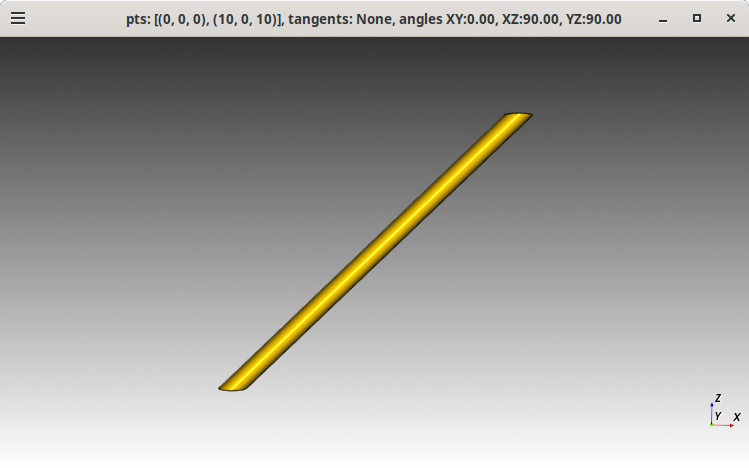
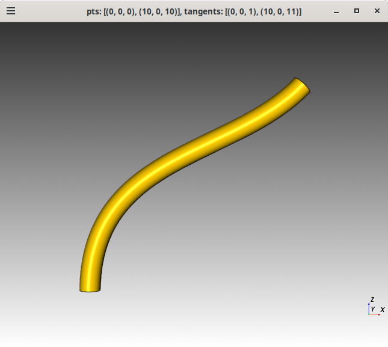
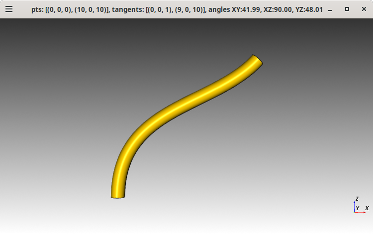
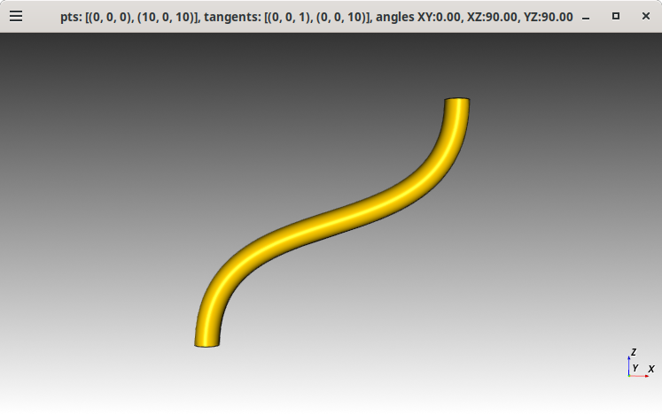
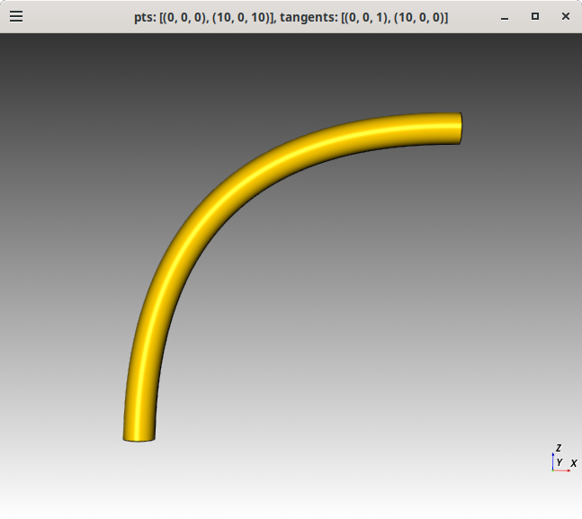

# cq-sweep

Explore using cadquery workplane.sweep which sweeps along a spline.
Using https://github.com/CadQuery/cadquery/blob/v2.5.2/examples/Ex023_Sweep.py as a base.


## Install
<!-- This section was produced by ChatGPT4.5. -->

This project uses a Makefile to simplify the installation process.
The Makefile automates the creation of a Conda environment, installation
of dependencies, and verification of the installation.

The following instructions will guide you through the installation process.

### Prerequisites
- **Python**: Python 3.10, 3.11, 3.12 (Python >3.12 is not yet supported).
- **Conda/Mamba**: Install [Mambaforge](https://github.com/conda-forge/miniforge#mambaforge) (recommended). If using Anaconda/Miniconda instead, you can use `conda` in place of `mamba` for the steps below.
- **Git**: Ensure Git is installed (to clone the repository).

### Installation Steps

1. **Clone this repository** and navigate into it:
    ~~~bash
    git clone <REPO_URL>
    cd <REPO_DIRECTORY>
    ~~~
    *(All commands below assume you are working inside this repository directory.)*

2. **Create a new Conda environment** for the project using **mamba** and the provided `environment.yml`:
    ~~~bash
    mamba env create -n cadquery-env -f environment.yml
    ~~~
    *If you don't have `mamba`, use `conda` instead:*
    ~~~bash
    conda env create -n cadquery-env -f environment.yml
    ~~~
    This will create an environment named `cadquery-env` (you can choose a different name by replacing `cadquery-env`).

3. **Activate the environment**:
    ~~~bash
    conda activate cadquery-env
    ~~~

4. **Install CadQuery** (choose one of the following options):
    - **Use CadQuery from conda-forge (default):** CadQuery should already be installed in the new environment (via the environment file). If not, install it with:
      ~~~bash
      mamba install -c conda-forge cadquery
      ~~~
      *(Use `conda install` if you don't have mamba.)*
    - **Use a local CadQuery source (optional, for development):** Clone and install CadQuery from source:
      ~~~bash
      make clone-local   # clone the CadQuery repository into ./cadquery
      make install-local # install the local CadQuery into the environment
      ~~~
      This will override the conda-forge installation with your local version of CadQuery.

5. **Verify the installation**:
    ~~~bash
    make verify
    ~~~
    This will run a quick test (import CadQuery and print its version) to confirm everything is set up correctly.

6. **Clean up** (optional):
    ~~~bash
    make clean
    ~~~
    This removes the `cadquery-env` environment, allowing you to start fresh if needed.

### Makefile Targets Summary
- **`make`** – Creates the Conda environment (if not already created) and installs all dependencies (including CadQuery via conda-forge).
- **`make clone-local`** – Clones the official CadQuery repository into a `cadquery/` subfolder for using a development version.
- **`make install-local`** – Installs CadQuery from the local `cadquery/` source into the environment (overriding any existing CadQuery installation).
- **`make verify`** – Activates the environment and runs a test script to verify that CadQuery is installed and functioning (e.g. imports CadQuery and prints its version).
- **`make clean`** – Deletes the Conda environment created for this project (so you can re-run the installation from scratch).

## Usage

```bash
$ ./cq-sweep.py -h
usage: cq-sweep.py [-h] [-br BASE_RADIUS] [-tr TOP_RADIUS] [-ml MID_LOCATION] [-p PTS] [-t TANGENTS] [-r ROLL] [-oas OUTPUT_ASCII_STL]
                   [-opng OUTPUT_PNG]

Sweep a cylinder along a path defined by points and optional tangents.

options:
  -h, --help            show this help message and exit
  -br, --base_radius BASE_RADIUS
                        Base radius of the cylinder. Example: --base_radius=0.5
  -tr, --top_radius TOP_RADIUS
                        Top radius of the cylinder. Example: --top_radius=0.15
  -ml, --mid_location MID_LOCATION
                        Location of mid section where transition begins to top_radius. value between 0..1. Example: --mid_location=0.5
  -p, --pts PTS         List of points defining the path. Example: --pts='[(0,0,0),(10,0,10)]'
  -t, --tangents TANGENTS
                        List of tangents for the path. Example: --tangents='[(0,0,1),(10,0,20)]'
  -r, --roll ROLL       Roll angle. Example: --roll=90
  -oas, --output-ascii-stl OUTPUT_ASCII_STL
                        Output an ASCII stl file. Example: --output-ascii-stl=filename' result is 'filename.stl'
  -opng, --output-png OUTPUT_PNG
                        Output as `.png` screenshot. Example: --output-png=filename' result is 'filename.png'
```

## Example

Straight cylinder along a 45 degree spline with no tangents.
```bash
$ ./cq-sweep.py --pts="[(0,0,0),(10,0,10)]" -opng="spline-45-degs_cylinder_top-no-tangents_faces-parallel"
Top face angles: {'XY': 44.99999999999991, 'XZ': 89.9999999999999, 'YZ': 45.00000000000009}
Bottom face angles: {'XY': 134.99999999999997, 'XZ': 89.99999999999999, 'YZ': 135.00000000000003}
```


---
Curved cylinder along a 45 degree spline with 1 unit long vertical tangents for the bottom and top faces.
```bash
$ ./cq-sweep.py --pts="[(0,0,0),(10,0,10)]" --tangents="[(0,0,1),(10,0,11)]"
Top face angles: {'XY': 42.27368900609325, 'XZ': 90.00000000000047, 'YZ': 47.72631099390675}
Bottom face angles: {'XY': 179.99999999999997, 'XZ': 89.99999999999997, 'YZ': 89.99999999999999}
```


Curved cylinder along a 45 degree spline with 1 unit long vertical tangents for the bottom face
and a 1 unit horizontal tangle for the top face
```bash
$ ./cq-sweep.py --pts="[(0,0,0),(10,0,10)]" --tangents="[(0,0,1),(9,0,10)]"
Top face angles: {'XY': 41.987212495815804, 'XZ': 90.00000000000044, 'YZ': 48.012787504184196}
Bottom face angles: {'XY': 180.0, 'XZ': 90.0, 'YZ': 90.0}
```


---
Curved cylinder along a 45 degree spline with 1 unit long vertical tangents for the bottom face
and a 10 unit long horizontal tangent for the bottom face.
The top and bottom faces "appear" to be parallel to each other.
```bash
$ ./cq-sweep.py -p="[(0,0,0),(10,0,10)]" -t="[(0,0,1),(0,0,10)]"
Top face angles: {'XY': 2.0349084617646358e-13, 'XZ': 90.0, 'YZ': 90.0000000000002}
Bottom face angles: {'XY': 179.99999999999994, 'XZ': 90.0, 'YZ': 90.00000000000006}
```


---
Curved cylinder along a 45 degree spline with 1 unit long vertical tangents for the bottom face
and a 10 unit long vertical tangent for the bottom face.
The top and bottom faces "appear" to be perpendicular to each other.
```bash
$ ./cq-sweep.py -p="[(0,0,0),(10,0,10)]" -t="[(0,0,1),(10,0,0)]"
Top face angles: {'XY': 89.99999999999987, 'XZ': 90.00000000000047, 'YZ': 4.892543547122269e-13}
Bottom face angles: {'XY': 180.0, 'XZ': 90.0, 'YZ': 90.0}
```


## License

Licensed under either of

- Apache License, Version 2.0 ([LICENSE-APACHE](LICENSE-APACHE) or http://apache.org/licenses/LICENSE-2.0)
- MIT license ([LICENSE-MIT](LICENSE-MIT) or http://opensource.org/licenses/MIT)

### Contribution

Unless you explicitly state otherwise, any contribution intentionally submitted
for inclusion in the work by you, as defined in the Apache-2.0 license, shall
be dual licensed as above, without any additional terms or conditions.
